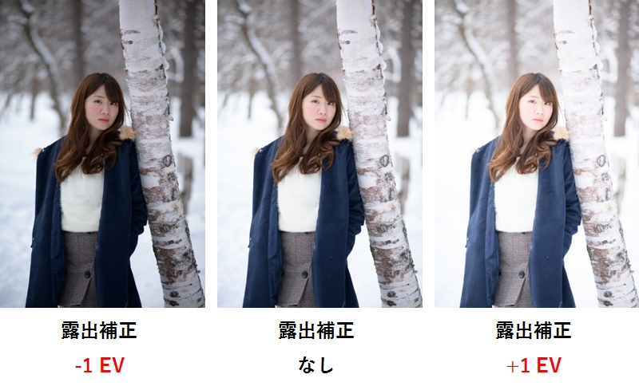
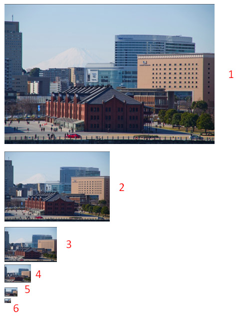
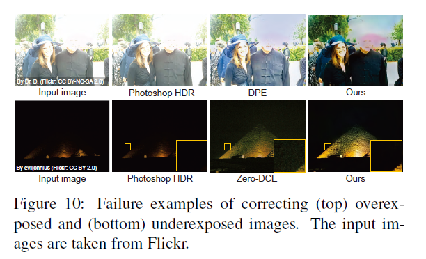

# 露出補正の最先端手法を勉強＆動かしてみた (Afifi et al., CVPR, 2021)
# はじめに

この記事は、MATLAB/Simulink Advent Calendar 2021（カレンダー2）の25日目の記事として書かれています。

[https://qiita.com/advent-calendar/2021/matlab](https://qiita.com/advent-calendar/2021/matlab)

間違いなどがあれば、教えていただけますと幸いです。 こちらの記事で用いたコードはこちらにアップロードしています。勉強会やまとめ資料用、ゼミ活動など、何かの役に立てば嬉しいです。

ここでは、低解像度の画像を高解像化する手法について勉強したため、そのまとめとして紹介します。詳細はもとの論文である、Maffi et al (2021) をご覧ください。

[Afifi, M., Derpanis, K.G., Ommer, B. and Brown, M.S., 2021. Learning Multi-Scale Photo Exposure Correction. In Proceedings of the IEEE/CVF Conference on Computer Vision and Pattern Recognition (pp. 9157-9167).](https://openaccess.thecvf.com/content/CVPR2021/html/Afifi_Learning_Multi-Scale_Photo_Exposure_Correction_CVPR_2021_paper.html)

**全体的に、説明が不足しているため、また加筆を行いたいと思います。**

# 今回の課題
## 明るい写真

こちらの写真は、夜に大学のある建物を撮影したものです。キレイではありますが、少し明るすぎますね。iphoneで撮影するときに明るくしすぎてしまったようです。せっかくのいい風景なので、いい感じに明るさを補正したいです。


## 暗い写真

次は三毛猫です。呼ぶと布団の中まで遊びに来てくれます。とてもかわいいです。しかし、布団の中ということもあり、とても暗いです。せっかくのいい写真なので、こちらも明るく、そして三毛猫の３つの色をきれいに補正して見てみたいです。


参考：写真・動画撮影で重要な露出(露光)について理解しよう

[https://www.camera-kb.com/exposure/](https://www.camera-kb.com/exposure/)

  
# 露出補正

以下の画像は、出典情報にもあるとおり、一眼レフの教科書さまからの引用です。上の建物と猫の画像では、カメラに入る光の量がうまく調整できておらず、明るすぎ/暗すぎる状態になっています。本来的には、以下の画像のように、カメラのパラメータや撮影方法を変更して最適な明るさで撮影されるべきですが、目的に応じて、後から補正したくなった/その場のカメラ/スマホのディスプレイの感じだとよくわからなかった、ということもあろうかと思います。



画像出典：一眼レフの教科書「一眼レフ初心者必見！露出補正で写真表現力を身につける」

https://camera-web.jp/beginner/rosyutsu-hosei

  
  
# 深層学習による補正

カメラのパラメータの調整やHDRなど、適正な明るさの画像を取得する方法はありますが、ひとまず、それらは置いておいて、深層学習によって後処理的に露出補正することを本記事では考えます。

  
# 本論文のイントロダクションの和訳

露出補正について学ぶために、本論文のイントロダクションを和訳してみます。

===========================================

撮影時の露出は、最終的な写真の明るさに直接影響する。デジタルカメラでは、主に次の3つの要素で露出を制御している。①シャッタースピード、②F値、③ISO値（受信画素信号の増幅率を制御する）の3つで行われます。 写真撮影では、露出設定を露出値（EV）で表し、各EVは同じ露出効果をもたらすカメラのシャッタースピードとF値の異なる組み合わせを意味する。写真撮影では「等光露出」とも呼ばれる。

　デジタルカメラでは、撮影した画像の明るさを変化させる目的で露出値を調整することができる。この調整は、ユーザーが手動で行う場合と、自動露出（AE）モードで自動的に行われる場合がある。AEを使用する場合、カメラは、シーンから受け取った光の量を測定するTTL（Through-the-Lens）モードを用いて、撮影したシーンの明るさの低さや高さを補正するために露出の度合いを調整する[53]。

　露出のエラーは、TTL測光の測定誤差、難しい照明条件（極端に低い照明や逆光など）、シーンの輝度レベルの急激な変化、ユーザーによるマニュアルモードでの誤差など、いくつかの要因で発生する。このような露出のエラーは撮影の初期段階に起こるもので、最終的な8bitの画像をレンダリングしたのちに補正することは困難である。なぜなら、最終的な8bitの標準RGB（sRGB）画像[32]をレンダリングするために、カメラのISP（イメージ・シグナル・プロセッサー）が高度な非線形演算を行うためである。

　図 1 は、露出エラーのある画像の典型例である。図1において、露出誤差は、最終的なレンダリング画像において、露出オーバーによる非常に明るい画像領域、または、露出アンダーによる非常に暗い領域のいずれかを生じさせる。このような誤差のある画像を補正することは、定評のある画像補正ソフトウェアパッケージをもっても困難な作業である（図9参照）。露出オーバーと露出アンダーはともに写真撮影ではよくあることであるが，先行研究のほとんどは，主に露出アンダーのエラー[23, 60, 62, 70, 71]の修正，または一般的な画質向上[10, 17]に絞って議論している。

## **貢献**

　我々は、露出オーバーと露出アンダーともに適用可能な、coarse-to-fineなディープラーニング手法を提案する。我々のアプローチでは、露出補正問題を2つの主要な問題に分けて定式化する。(i) 色彩補正と(ii)詳細補正である。エンドツーエンドで学習可能なディープニューラルネットワーク（DNN）モデルを提案し、グローバルな色情報を補正することから始め、その後、画像の細部を補正する。ここで提案するDNNモデルに加え、露出補正問題への重要な貢献は、これまでのデータセットよりも広い露出範囲を持つ異なる露出設定でraw-RGBからsRGBにレンダリングした24000枚以上の画像を含む新しいデータセットである。このデータセットに含まれる各画像には、対応する適正露出の参照画像がペアとして利用可能である。最後に、提案手法の評価とablation studyを、最新の技術とも比較しながら行う。本手法は、露出アンダーの画像に特化した従来の手法と同程度の結果を達成し、露出オーバーの画像では大幅な改善をもたらすことを実証する。さらに、我々のモデルは、我々のデータセット以外の画像に対しても良好に汎用化することができる。

===========================================

参考：移動体を含む状況下でもうまくHDRする研究

[https://www.research.oit.ac.jp/oitid/archive/2020/seeds/seeds-3545/](https://www.research.oit.ac.jp/oitid/archive/2020/seeds/seeds-3545/)

下の図は、Maffi et al (2021) の図１からの引用です。左上の、露出オーバーの画像は、右上のように補正され、左下の露出アンダーの画像は右下のようにうまく補正されています。


  
# 試してみた結果

以下の図は、この論文の手法を自分のデータで試した時の結果です。

筆者によるオリジナルの実装は以下のgithubレポジトリにあります。

https://github.com/mahmoudnafifi/Exposure_Correction

左側の画像はカメラに入るカメラが多く、全体的に白くなってしまっています（露出オーバー）。右側の画像では、それらの色が補正され、より美しい画像になっていることがわかります。

  

一方、以下の例は、右側の画像が非常に暗い場所で撮られていて、画像全体が非常に暗いことがわかります（露出アンダー）。

左側の画像は、ここで紹介する手法によって補正されたときの結果です。三毛猫の色も非常に忠実に再現されていて、大変うまく補正ができていることがわかります。

  

[https://imgsli.com/ODczNzk](https://imgsli.com/ODczNzk)

  

これらのように、明るすぎた/暗すぎた画像もうまく補正できていてすごいです。三毛猫にいたっては、三毛猫の３つの色もほぼ完ぺきに再現できていて、驚くばかりです。深層学習では、その特定のデータセット内ではうまく行っても、新規のデータ（布団の中に入ってきてくれた猫）にはうまく行かないことも多いのですが、今回は、ここでお見せした画像以外でもうまく行っています。

  
# この手法のポイント

簡単にポイントを述べると

   -  深層学習による方法で、適正露出の画像と露出オーバー/アンダーの画像をペアにして学習させている 
   -  露出オーバー/アンダーの画像のどちらともに対応できる 
   -  入力の画像をラプラシアンピラミッドにより、異なる周波数特性を持つ画像に分解し、訓練/推論させている 
   -  ラプラシアンピラミッドにて、画像を異なる周波数成分の画像に分解し、それぞれに対して補正を行うことで、1) 色の補正、2) 詳細の補正をうまくネットワークに分担させている 
   -  前回のブログ記事で紹介したような、image-to-image回帰的な方法に加え、GANの技術（Adversarial Loss）を導入し、精度を向上させている 

などといったことが挙げられると思います。

# この手法のポイント：ラプラシアンピラミッドについて

下の図は、もとの論文の図3より引用しています。図Aは露出オーバーの画像と、そこから得られるラプラシアンピラミッド、図Bは適正露出の画像とそのラプラシアンピラミッドです。一方、図Cは露出オーバーのAの画像のラプラシアンピラミッドの最後のピラミッドのみをBの者と入れ替え、再構成をしたときの結果です。Dは最後の2つを交換し、再構成したときの結果です。色味に関しては、ラプラシアンピラミッドの最後の成分を補正すればうまく、露出の補正自体も行えそうです。つまりこの手法では画像を各周波数成分に分解し、それらを補正することを目指します。


## ラプラシアンピラミッドについて

この手法では、画像そのものを入力にするのではなくて、ラプラシアンピラミッドにて画像を以下のように分けて入力しています。

以下の記事を参考にラプラシアンピラミッドを作成します。ラプラシアンピラミッド（やガウシアンピラミッド）では、画像のエッジ処理のよなことを繰り返し行い、周波数成分に分けていきます。

  

この論文の実装では、以下のフィルターを用いて、ガウシアンピラミッドおよびラプラシアンピラミッドを作成しています。

```matlab:Code
f = [0.0025    0.0125    0.0200    0.0125    0.0025
    0.0125    0.0625    0.1000    0.0625    0.0125
    0.0200    0.1000    0.1600    0.1000    0.0200
    0.0125    0.0625    0.1000    0.0625    0.0125
    0.0025    0.0125    0.0200    0.0125    0.0025]
```

また、MATLABのimpyramid関数では、Burt and Adelson の[論文](https://jp.mathworks.com/help/images/ref/impyramid.html#bvozh1q)の 533 ページで指定されるカーネルを使用します。OpenCVでもカーネルの記述がありましたが、少しカーネルの定義が異なるかもしれません。

[https://jp.mathworks.com/help/images/ref/impyramid.html](https://jp.mathworks.com/help/images/ref/impyramid.html)

  

ラプラシアンフィルタにより、画像の2次微分に相当する操作を行います。しかし、その前準備として、ガウシアンフィルタを用いて、ガウシアンピラミッドを作成する必要があります。画像は、[虹色の旋律](http://nijikarasu.cocolog-nifty.com/blog/) さまの、**ガウシアンピラミッドを使った画像処理**より引用させていただいております。入力の画像に対して、上のフィルタにて演算をし、出力のサイズを縦横共に半分にしていきます。それを自分で設定した数だけ繰り返し、以下のようなピラミッドのような連なりを作成していきます。



画像出典：[虹色の旋律](http://nijikarasu.cocolog-nifty.com/blog/) さま「**ガウシアンピラミッドを使った画像処理**」

[http://nijikarasu.cocolog-nifty.com/blog/2015/04/post-2313.html](http://nijikarasu.cocolog-nifty.com/blog/2015/04/post-2313.html)

  

上のピラミッド中の各画像を２倍に拡大すると以下のようになって、ガウシアンカーネルにて計算することで、画像がどんどん滑らか（エッジがなくなっていている）になっています。別の言い方をすると、高周波な画像から低周波な画像に分解できていることがわかります。


画像出典：[虹色の旋律](http://nijikarasu.cocolog-nifty.com/blog/) さま「**ガウシアンピラミッドを使った画像処理**」

[http://nijikarasu.cocolog-nifty.com/blog/2015/04/post-2313.html](http://nijikarasu.cocolog-nifty.com/blog/2015/04/post-2313.html)

  

次に、以下のように、n番目と、n-1番目の演算結果を引き算します。これが画像の2次微分に相当します。

そして、この分解した画像を再構成する際には以下のように、単にラプラシアンピラミッドの各画像を足し合わせます。その際、ガウシアンピラミッドの画像は、引き算するときに2倍に拡大してサイズをそろえます。

  
  
  


ICHI.PROさま：レビュー：LAPGAN —ラプラシアン生成的敵対的ネットワーク（GAN）中の図を改変

https://ichi.pro/rebyu-lapgan-rapurashian-seiseiteki-tekitaiteki-nettowa-ku-gan-255576336226343

  

なお、こちらの説明は以下のMATLABのブログを参考にしました。

[https://blogs.mathworks.com/steve/2019/04/16/multiresolution-pyramids-part-3-laplacian-pyramids/?from=jp](https://blogs.mathworks.com/steve/2019/04/16/multiresolution-pyramids-part-3-laplacian-pyramids/?from=jp)

  

猫の画像のラプラシアンピラミッドを可視化すると以下のようになります。


  

また、左が入力画像、右がラプラシアンピラミッドに分解後、上のように足し合わせ、再び入力画像を復元したものです。ラプラシアンピラミッドにて周波数ごとに分解したのちに、再び復元することができます。以下のネットワークでは、これらの特性を生かし、各ラプラシアンピラミッドをエッジ成分の補正、色成分の補正、など、それぞれの役割分担をし、補正→再構成をします。RGB画像をそのまま入れるのではなく、このように周波数特性を考慮しながら補正を行っていきます。


  

ラプラシアンピラミッドに関しては、以下の記事などが参考になりました。

[https://blog.shikoan.com/pytorch-laplacian-pyramid/](https://blog.shikoan.com/pytorch-laplacian-pyramid/)

また、より詳しく、流れに沿って理解したいときに以下の書籍（デジタル画像処理）の5章が参考になりました。

[https://www.amazon.co.jp/dp/B085L18YXF/ref=dp-kindle-redirect?_encoding=UTF8\&btkr=1](https://www.amazon.co.jp/dp/B085L18YXF/ref=dp-kindle-redirect?_encoding=UTF8&btkr=1)

  
# この手法について
## 入力画像の処理の流れ

以下にこの手法のネットワークの図を示します。この手法では、１）全体的な色の補正 および ２）詳細の補正 の2つの役割に分けられていて、下の黄色のネットワークが１）の全体的な色の補正に使われる、と論文中にあります。

ただ、これは明示的に黄色のネットワークにRGBの補正の操作をさせているわけではなく、まずはラプラシアンピラミッドのｎ番目（公式の実装では n = 4）の画像が色味を多く有するので結果的に一番初めの、黄色の部分で色の補正をしていることになっているものだと思います。

   1.  ｎ番目のラプラシアンピラミッド（露出オーバーや露出アンダーのもの）を入力し、それを適正露出の画像（つまり正解データ）から得られたｎ番目のラプラシアンピラミッドに変換 
   1.  n-1番目のラプラシアンピラミッドを入力し同様の操作を行う 
   1.  1番目のラプラシアンピラミッドまで繰り返す 

という流れだと思います。

ここで、黄色のネットワークでレベルnのピラミッドを処理しYnを生成、紫のネットワークでアップサンプリング（拡大）したあとに、レベルn-1のピラミッド(Xn-1)を足し合わせています(Yn+Xn-1)。そして、次のレベルのピラミッドを推論することを目指します。

**ここでの Yn+Xn-1 とは、つまり、n-1番目のガウシアンピラミッドということになります**。

  


# 損失関数について

ここでは、損失を3つに分けて定義しています。

## Reconstruction Loss

再構成誤差。訓練データセットでは、露出アンダー/オーバーの画像と適正露出のペアが与えられています。そのため、このネットワークで再構成して画像と、それに対応する適正露出の画像を比べて、L1損失を計算します。


## Pyramid Loss

ピラミッドに関する損失。上の再構成誤差のみで最適化するよりもこの損失を入れる方が結果が安定するようです。このネットワークでは、サイズの小さい、つまり、n番目（最後）のピラミッドから入力していきます。そこからn-1番目...のピラミッドを再構成したときの誤差を最小化していきます。

## Adversarial Loss

ここで、GANの仕組みが導入されています。以前のブログ記事でも、触れましたが、単にimage-to-imageな回帰で、損失関数を平均二乗誤差にすると、「ありそうな」画像を平坦化してような画像ができてしまい、少しエッジがなまった画像が生成されがちだと述べていました。

  

一方、こちらの論文では、判別器(`discriminator`)を用意し、学習の過程でそれが今回のネットワークで補正された画像なのか、それとももともと適正に補正されたもの（正解データそのもの）かを判別します。

つまり、ミニバッチで補正した画像Xとそれの正解データ（対応する、適正露出の画像）Yの両方を`discriminator`に投げて、補正をする生成するネットワークから生み出されたものか、それとも正解データなのかを判別させて、生成モデルのほうを鍛えていきます。

  

srcファイルの中のmodelGradients.mの24行目に偽物かどうかの判別器を動かしています。

```matlab:Code
dlYPred = forward(dlnetDiscriminator, dlY_D);
```

また同ファイルの31行目でその時の損失（Loss）を計算しています

```matlab:Code
[lossGenerator, lossDiscriminator, Rloss, Gloss] = final_Loss(dlY, dlXGenerated, dlYPred, dlYPredGenerated);
```

# 学習済みモデルの可視化について

学習済みモデルを可視化して、例えば、入力のサイズを確認してみます。以下のようにモデルをインポートして、analyzeNetworkを用います。

```matlab:Code
load('models/model.mat') % windowsにて実行
analyzeNetwork(net)
```

すると、以下の黄色で囲われているように、アクティベーションのところで、512×512×12であることがわかります。512というのは画像の縦と横のサイズです。12というのは、RGBの3チャンネルが4つ分のことです。先ほど説明したように、RGBの画像をラプラシアンピラミッドで4つの画像に展開しているためです。この4というパラメータは自前のデータで行う場合は適宜変更することができます。また、ここでの実装では、画像のサイズを128, 256, 512の3つのパターンを行って学習を完了をさせており、マルチスケールでの学習を行っています。

  


  

また、同様に出力も512×512×12で、入力と同じであることがわかります。


  
  
  
# 実際に動かしてみる
  

まずは、こちらの`install_.m`というファイルを実行します。installとあるので、何かをダウンロードするのかと思いましたが、そうではなく、`scr`という名前のフォルダを参照できるように、`addpath`します。


  

そのあとに、demo_single_image.mを実行すれば、example_imagesファイル内の画像に対して、補正が行われます。bgu, demo, ...といったファイルの見える場所で実行して、パスの位置だけ確認すれば、特に特別な設定も必要なく動きました。

# 今後の課題

   -  以下の図の上段のように、光が多すぎて、男性の顔の周辺の情報が失われている場合はうまく補正できなかったり、下段のように暗すぎるとノイズが発生することが今後の課題として挙げられています。同時に他の手法でも難しいと述べられています。 
   -  特に顔などは、情報がないと復元は直感的に考えてできないので、ある程度は仕方ないのかもしれないですね。 



# まとめ

   -  今回は、Afifiら (2021)の方法を勉強し、動かしてみました 
   -  簡単に、かつ、非常にうまく色の補正ができて、非常に素晴らしい手法だと感じました 
   -  特に三毛猫の色までうまく再現できていて、とても嬉しかったです 

# 参考文献

[1] [Afifi, M., Derpanis, K.G., Ommer, B. and Brown, M.S., 2021. Learning Multi-Scale Photo Exposure Correction. In Proceedings of the IEEE/CVF Conference on Computer Vision and Pattern Recognition (pp. 9157-9167).](https://openaccess.thecvf.com/content/CVPR2021/html/Afifi_Learning_Multi-Scale_Photo_Exposure_Correction_CVPR_2021_paper.html)

[2] [Burt, P.J. and Adelson, E.H., 1987. The Laplacian pyramid as a compact image code. In Readings in computer vision (pp. 671-679). Morgan Kaufmann.](https://www.seas.upenn.edu/~cse399b/LaplacianPyramid.pdf)
